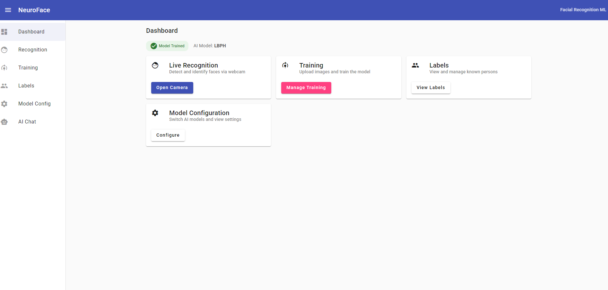
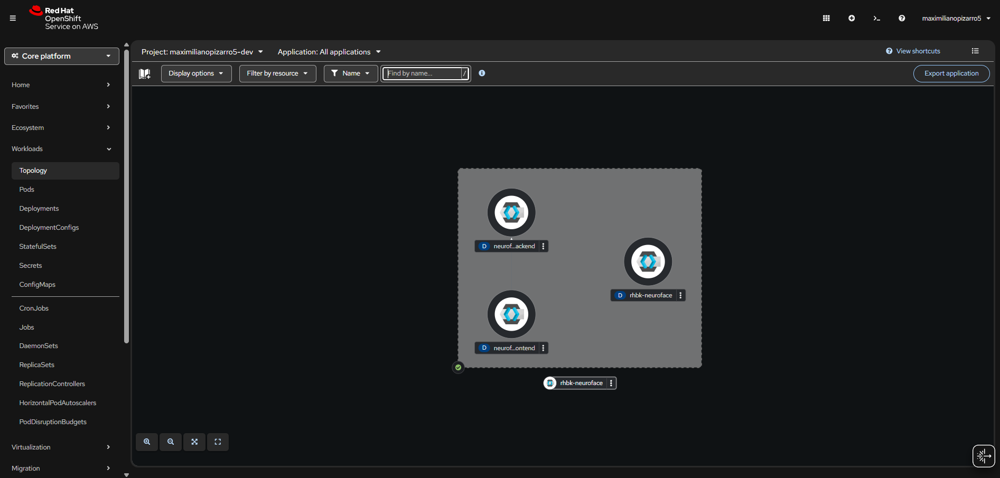

  
  <h1>RHBK NeuroFace Biometric Flow</h1>
  

    Red Hat Build of Keycloak with biometric facial recognition authentication via NeuroFace
  

  

    RHBK 26.0
    Keycloak SPI
    Facial 2FA
    OpenShift
  

<h2>Demo — Biometric Authentication Flow</h2>

  

    

      <iframe src="https://www.youtube.com/embed/_PcsflxvJWY" title="RHBK Biometric Flow - Short Demo" allow="accelerometer; autoplay; clipboard-write; encrypted-media; gyroscope; picture-in-picture" allowfullscreen></iframe>
    

    

      <h4>Biometric Authentication Flow</h4>
      
Quick demo of the delegated creation and 2FA facial recognition flow with RHBK and NeuroFace

    

  

<h2>Demo — NeuroFace Facial Recognition</h2>

  

    

      <iframe src="https://www.youtube.com/embed/lvFu5u7slXg" title="NeuroFace - Facial Recognition Usage" allow="accelerometer; autoplay; clipboard-write; encrypted-media; gyroscope; picture-in-picture" allowfullscreen></iframe>
    

    

      <h4>NeuroFace — Facial Recognition in Action</h4>
      
Full walkthrough of the NeuroFace webapp: training, recognition, and model configuration

    

  

<h2>Overview</h2>

  
🔐

  <h4>Delegated Creation + Biometric Enrollment</h4>
  
Admin creates users in Keycloak. On first login, users enroll their face via webcam — 3 to 5 captures from different angles sent to NeuroFace for model training.

  
👤

  <h4>Second Factor Authentication (2FA)</h4>
  
After password login, users verify their identity through facial recognition. The SPI calls NeuroFace <code>/api/recognize</code> and matches against the enrolled profile.

  
📦

  <h4>Single Helm Install</h4>
  
One <code>helm install</code> deploys both RHBK and NeuroFace in the same namespace with pre-configured realm, clients, flows, and roles.

<h2>Architecture</h2>

<pre>
┌─────────────────────────────────┐     ┌──────────────────────────────────┐
│  RHBK (Keycloak 26 - UBI9)     │     │  NeuroFace Backend (FastAPI)     │
│                                 │     │                                  │
│  ┌───────────────────────────┐  │     │  POST /api/images   ← enrollment│
│  │ Biometric SPI (JAR)       │  │     │  POST /api/train    ← training  │
│  │                           │──┼─────┼─►POST /api/recognize ← verify   │
│  │ • BiometricAuthenticator  │  │     │  GET  /api/health   ← health    │
│  │   (2FA facial login)      │  │     │  GET  /api/labels   ← labels    │
│  │                           │  │     │                                  │
│  │ • BiometricEnrollment     │  │     └──────────────────────────────────┘
│  │   (delegated registration)│  │
│  └───────────────────────────┘  │     ┌──────────────────────────────────┐
│                                 │     │  NeuroFace Frontend (Angular 17) │
│  Realm: neuroface               │     │  ← Protected by OIDC client     │
│  Client: neuroface-app          │     │     "neuroface-app"              │
│  Flow: biometric browser        │     └──────────────────────────────────┘
│  Flow: biometric registration   │
└─────────────────────────────────┘
</pre>

<h2>Screenshots</h2>

  
  
NeuroFace — Facial Recognition Webapp with ML (OpenCV LBPH / dlib)

  
  
OpenShift Topology — RHBK + NeuroFace deployed in the same namespace

  
  
Helm Chart Catalog — rhbk-neuroface available on Artifact Hub

  
  
Helm Chart Catalog — NeuroFace dependency chart

<h2>NeuroFace — Facial Recognition Service</h2>

  <a href="https://github.com/maximilianoPizarro/neuroface" target="_blank">NeuroFace</a> is a facial recognition webapp built with <strong>FastAPI</strong> and <strong>Angular 17</strong>, containerized with Red Hat UBI9 certified images. It provides the ML backend that powers the biometric authentication.

<h3>API Endpoints Used by the SPI</h3>

<table>
  <thead>
    <tr><th>Endpoint</th><th>Method</th><th>Usage</th></tr>
  </thead>
  <tbody>
    <tr><td><code>/api/health</code></td><td><code>GET</code></td><td>Health check before biometric operations</td></tr>
    <tr><td><code>/api/images</code></td><td><code>POST</code></td><td>Upload facial images during enrollment (multipart)</td></tr>
    <tr><td><code>/api/train</code></td><td><code>POST</code></td><td>Train the recognition model after enrollment</td></tr>
    <tr><td><code>/api/recognize</code></td><td><code>POST</code></td><td>Verify facial identity during 2FA login</td></tr>
    <tr><td><code>/api/labels</code></td><td><code>GET</code></td><td>List registered biometric labels</td></tr>
  </tbody>
</table>

<h2>Authentication Flows</h2>

<h3>1. Delegated Creation with Biometric Enrollment</h3>

<pre>
KC Admin ──► Creates user ──► Assigns Required Action "Biometric Enrollment"
                                          │
                                          ▼
                               User logs in with
                               temporary credentials
                                          │
                                          ▼
                               Webcam: captures 3-5 images
                               from different angles
                                          │
                                          ▼
                               SPI → POST /api/images (label=username)
                               SPI → POST /api/train
                                          │
                                          ▼
                               biometric_enrolled = true
                               User joins group "biometric-enrolled"
</pre>

<h3>2. Login with Biometric Second Factor (2FA)</h3>

<pre>
User ──► Login page ──► username + password
                                │
                                ▼
                       Biometric verification (2FA)
                       Webcam captures facial image
                                │
                                ▼
                       SPI → POST /api/recognize { "image": base64 }
                                │
                                ▼
                       label == username AND
                       confidence >= threshold?
                          │              │
                         YES             NO
                          ▼              ▼
                       Access         Access
                       granted        denied
</pre>

<h2>Quick Start</h2>

<h4>From Helm Repository</h4>
<pre><code>helm repo add rhbk-neuroface https://maximilianopizarro.github.io/rhbk-biometric-flow/
helm repo update

helm install rhbk-neuroface rhbk-neuroface/rhbk-neuroface \
  -n neuroface --create-namespace \
  --set admin.password=changeme</code></pre>

<h4>From Source</h4>
<pre><code>git clone https://github.com/maximilianoPizarro/rhbk-biometric-flow.git
cd rhbk-biometric-flow

helm dependency update helm/rhbk-neuroface
helm install rhbk-neuroface ./helm/rhbk-neuroface \
  -n neuroface --create-namespace \
  --set admin.password=changeme</code></pre>

<h2>Helm Chart Values</h2>

<h3>RHBK (Keycloak)</h3>

<table>
  <thead>
    <tr><th>Parameter</th><th>Default</th><th>Description</th></tr>
  </thead>
  <tbody>
    <tr><td><code>rhbk.image.repository</code></td><td><code>registry.redhat.io/rhbk/keycloak-rhel9</code></td><td>RHBK image</td></tr>
    <tr><td><code>rhbk.image.tag</code></td><td><code>26.0</code></td><td>Image tag</td></tr>
    <tr><td><code>rhbk.replicas</code></td><td><code>1</code></td><td>Replicas</td></tr>
    <tr><td><code>rhbk.resources.limits.cpu</code></td><td><code>1</code></td><td>CPU limit</td></tr>
    <tr><td><code>rhbk.resources.limits.memory</code></td><td><code>1Gi</code></td><td>Memory limit</td></tr>
  </tbody>
</table>

<h3>Admin &amp; Realm</h3>

<table>
  <thead>
    <tr><th>Parameter</th><th>Default</th><th>Description</th></tr>
  </thead>
  <tbody>
    <tr><td><code>admin.username</code></td><td><code>admin</code></td><td>Bootstrap admin user</td></tr>
    <tr><td><code>admin.password</code></td><td><code>admin</code></td><td>Bootstrap admin password</td></tr>
    <tr><td><code>realm.name</code></td><td><code>neuroface</code></td><td>Realm name</td></tr>
    <tr><td><code>realm.displayName</code></td><td><code>NeuroFace Biometric</code></td><td>Display name</td></tr>
  </tbody>
</table>

<h3>Biometric Settings</h3>

<table>
  <thead>
    <tr><th>Parameter</th><th>Default</th><th>Description</th></tr>
  </thead>
  <tbody>
    <tr><td><code>biometric.confidenceThreshold</code></td><td><code>65.0</code></td><td>Minimum confidence (0-100)</td></tr>
    <tr><td><code>biometric.maxEnrollmentImages</code></td><td><code>5</code></td><td>Max enrollment images</td></tr>
    <tr><td><code>biometric.webcamWidth</code></td><td><code>640</code></td><td>Webcam width (px)</td></tr>
    <tr><td><code>biometric.webcamHeight</code></td><td><code>480</code></td><td>Webcam height (px)</td></tr>
  </tbody>
</table>

<h3>SPI Image</h3>

<table>
  <thead>
    <tr><th>Parameter</th><th>Default</th><th>Description</th></tr>
  </thead>
  <tbody>
    <tr><td><code>spi.image.repository</code></td><td><code>quay.io/maximilianopizarro/rhbk-neuroface-spi</code></td><td>SPI image</td></tr>
    <tr><td><code>spi.image.tag</code></td><td><code>latest</code></td><td>Tag</td></tr>
  </tbody>
</table>

<h3>NeuroFace Subchart Overrides</h3>

<table>
  <thead>
    <tr><th>Parameter</th><th>Default</th><th>Description</th></tr>
  </thead>
  <tbody>
    <tr><td><code>neuroface.enabled</code></td><td><code>true</code></td><td>Deploy NeuroFace subchart</td></tr>
    <tr><td><code>neuroface.backend.image.tag</code></td><td><code>latest</code></td><td>Backend image tag</td></tr>
    <tr><td><code>neuroface.backend.replicas</code></td><td><code>1</code></td><td>Backend replicas</td></tr>
    <tr><td><code>neuroface.backend.aiModel</code></td><td><code>lbph</code></td><td>AI model (<code>lbph</code> / <code>dlib</code>)</td></tr>
    <tr><td><code>neuroface.frontend.image.tag</code></td><td><code>latest</code></td><td>Frontend image tag</td></tr>
    <tr><td><code>neuroface.frontend.replicas</code></td><td><code>1</code></td><td>Frontend replicas</td></tr>
    <tr><td><code>neuroface.chat.enabled</code></td><td><code>true</code></td><td>Enable AI chat feature</td></tr>
    <tr><td><code>neuroface.persistence.enabled</code></td><td><code>true</code></td><td>Enable persistent storage</td></tr>
    <tr><td><code>neuroface.persistence.size</code></td><td><code>1Gi</code></td><td>PVC size</td></tr>
    <tr><td><code>neuroface.route.enabled</code></td><td><code>true</code></td><td>Create NeuroFace Route</td></tr>
  </tbody>
</table>

<h3>Route &amp; Service</h3>

<table>
  <thead>
    <tr><th>Parameter</th><th>Default</th><th>Description</th></tr>
  </thead>
  <tbody>
    <tr><td><code>route.enabled</code></td><td><code>true</code></td><td>Create RHBK OpenShift Route</td></tr>
    <tr><td><code>route.tls.termination</code></td><td><code>edge</code></td><td>TLS termination</td></tr>
    <tr><td><code>service.type</code></td><td><code>ClusterIP</code></td><td>Service type</td></tr>
    <tr><td><code>service.httpPort</code></td><td><code>8080</code></td><td>HTTP port</td></tr>
    <tr><td><code>service.port</code></td><td><code>8443</code></td><td>HTTPS port</td></tr>
  </tbody>
</table>

<h2>Realm Configuration</h2>

<table>
  <thead>
    <tr><th>Component</th><th>Details</th></tr>
  </thead>
  <tbody>
    <tr><td><strong>Clients</strong></td><td><code>neuroface-app</code> (public, PKCE S256), <code>neuroface-backend</code> (bearer-only)</td></tr>
    <tr><td><strong>Browser Flow</strong></td><td><code>biometric browser</code> — cookie OR (password + facial 2FA)</td></tr>
    <tr><td><strong>Registration Flow</strong></td><td><code>biometric registration</code> — delegated creation</td></tr>
    <tr><td><strong>Required Action</strong></td><td><code>biometric-enrollment</code> — facial enrollment on first login</td></tr>
    <tr><td><strong>Roles</strong></td><td><code>biometric-user</code>, <code>biometric-admin</code></td></tr>
    <tr><td><strong>Group</strong></td><td><code>biometric-enrolled</code> — auto-assigned after enrollment</td></tr>
  </tbody>
</table>

<h2>SPI Components</h2>

<table>
  <thead>
    <tr><th>Provider</th><th>Type</th><th>ID</th><th>Description</th></tr>
  </thead>
  <tbody>
    <tr><td>BiometricAuthenticator</td><td>Authenticator</td><td><code>biometric-authenticator</code></td><td>2FA via NeuroFace <code>/api/recognize</code></td></tr>
    <tr><td>BiometricEnrollment</td><td>Required Action</td><td><code>biometric-enrollment</code></td><td>Multi-image facial enrollment</td></tr>
    <tr><td>NeuroFaceClient</td><td>Internal</td><td>—</td><td>HTTP client for NeuroFace REST API</td></tr>
  </tbody>
</table>

<h2>Links</h2>

  <h4>📂 Source Code</h4>
  
<a href="https://github.com/maximilianoPizarro/rhbk-biometric-flow">github.com/maximilianoPizarro/rhbk-biometric-flow</a>

  <h4>🧠 NeuroFace</h4>
  
<a href="https://github.com/maximilianoPizarro/neuroface">github.com/maximilianoPizarro/neuroface</a>

  <h4>📖 RHBK Docs</h4>
  
<a href="https://docs.redhat.com/en/documentation/red_hat_build_of_keycloak/26.0/">Red Hat Build of Keycloak 26.0 Documentation</a>

  <h4>🏗️ Artifact Hub — rhbk-neuroface</h4>
  
<a href="https://artifacthub.io/packages/helm/rhbk-neuroface/rhbk-neuroface">artifacthub.io/packages/helm/rhbk-neuroface</a>

  <h4>🏗️ Artifact Hub — neuroface</h4>
  
<a href="https://artifacthub.io/packages/helm/neuroface/neuroface">artifacthub.io/packages/helm/neuroface</a>

